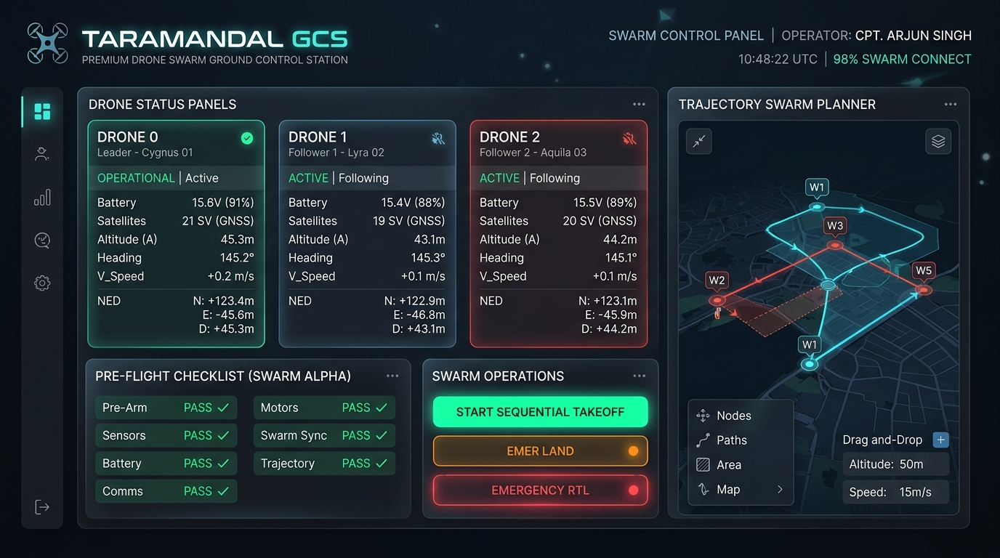
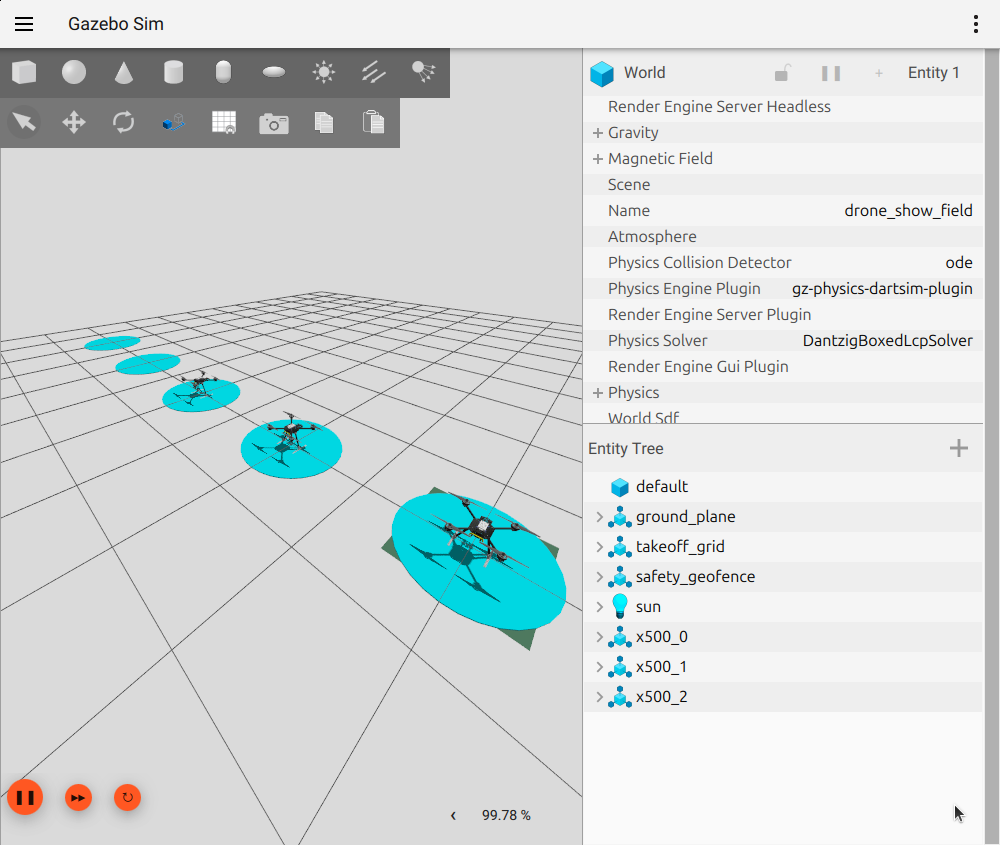
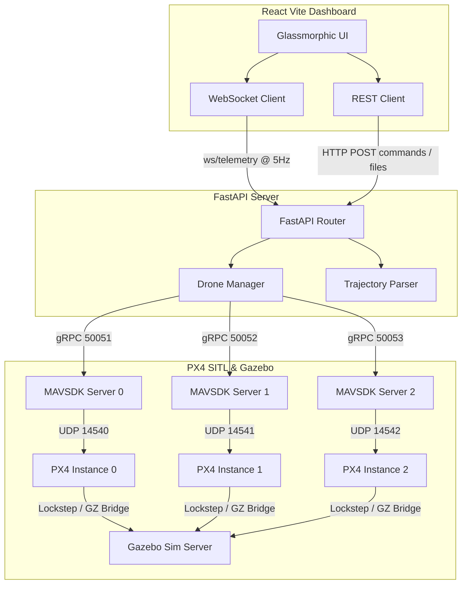
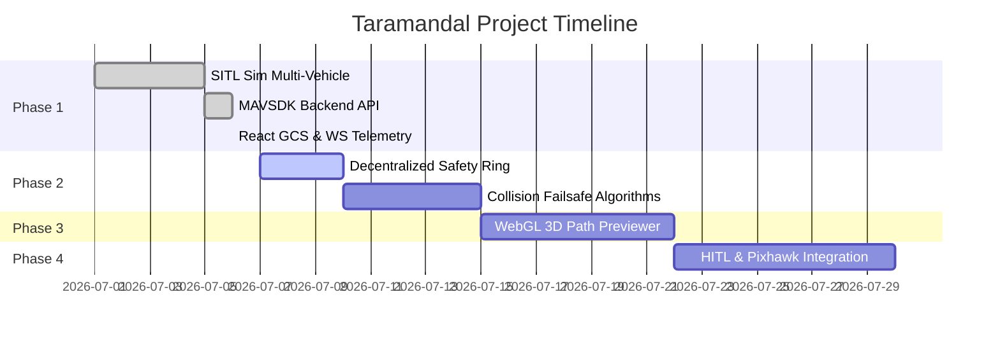

# 🛸 Taramandal Ground Control Station (GCS) & Swarm Simulator

Taramandal GCS is a high-tech, cybernetic command-and-control dashboard and Software-in-the-Loop (SITL) simulation suite designed to coordinate, arm, and fly autonomous drone swarm fleets. 

Built on top of **MAVSDK**, **FastAPI (Python)**, and **React (Vite)**, the GCS interfaces directly with multiple virtual vehicles running in the **PX4 Autopilot** flight stack and **Gazebo physics engine**.

---

## 🎨 System Interfaces

### 🖥️ Swarm GCS Dashboard Interface
The React dashboard is styled with modern dark mode and premium glassmorphism, displaying real-time telemetry, a pre-flight checklist, flight commands, and a trajectory swarm planner.


### 🛰️ Gazebo Simulator (Custom Drone Show Arena)
Our custom `drone_show_field` world features visual launch pads (aligned coordinates) and a red safety boundary fence.


---

## 🛠️ System Architecture

The ground control station coordinates telemetry and flight commands using a decoupled architecture:



---

## 📋 Features

1. **Pre-flight Checklist:** Green-light locks for connectivity verification (3/3 drones connected), GPS health (minimum 6 satellites per drone), and battery thresholds (>75%).
2. **Master Control Operations:** Start sequential takeoff (1-second separation delay), emergency Return-to-Launch (RTL), and immediate emergency landing.
3. **Telemetry Streaming:** Real-time feedback of coordinates (Local X, Y, Z), flight modes, satellites count, connection status, and battery percentage/voltage.
4. **Trajectory Ingestor:** Supports uploading CSV/JSON time-ordered waypoint trajectories and plays them back dynamically via linear coordinate interpolation.
5. **Custom Simulation Environment:** Preloaded open-world Gazebo field (`drone_show_field.sdf`) with spatial separation launching alignments.

---

## 🚀 Getting Started

### Prerequisites
* **PX4-Autopilot:** Installed and compiled locally in `/home/harsh-pandhe/PX4-Autopilot`.
* **Gazebo Sim:** Version 8 or newer.
* **Python:** 3.10+
* **Node.js:** 18+

### 1. Launching the Simulator
To start the 3-drone simulation in Gazebo with the graphical GUI enabled:
```bash
bash scripts/launch_fleet.sh -n 3
```
*Note: To run the simulator headlessly (no Gazebo UI window), pass the `-h` flag:*
```bash
bash scripts/launch_fleet.sh -n 3 -h
```

### 2. Sourcing and Running the Backend
From the root of the repository:
```bash
# Activate Python Virtual Environment
source .venv/bin/activate

# Install requirements (if not done)
pip install -r requirements.txt

# Start FastAPI server
uvicorn backend.main:app --host 0.0.0.0 --port 8000
```
The Swagger API documentation will be available at [http://localhost:8000/docs](http://localhost:8000/docs).

### 3. Launching the GCS Dashboard
In a new terminal tab:
```bash
cd frontend
npm install
npm run dev -- --host 0.0.0.0 --port 5173
```
Access the GCS interface in your browser at [http://localhost:5173/](http://localhost:5173/).

---

## 📐 Trajectory File Format Specifications

You can upload either JSON or CSV files into the **Trajectory Swarm Planner** sidebar.

### JSON Schema
```json
{
  "drones": [
    {
      "id": 0,
      "waypoints": [
        {"time": 0.0, "x": 0.0, "y": 0.0, "z": -2.0, "yaw": 0.0},
        {"time": 5.0, "x": 5.0, "y": 0.0, "z": -2.0, "yaw": 90.0},
        {"time": 10.0, "x": 5.0, "y": 5.0, "z": -3.0, "yaw": 180.0}
      ]
    },
    {
      "id": 1,
      "waypoints": [
        {"time": 0.0, "x": 0.0, "y": 2.0, "z": -2.7, "yaw": 0.0},
        {"time": 5.0, "x": 5.0, "y": 2.0, "z": -2.7, "yaw": 90.0},
        {"time": 10.0, "x": 5.0, "y": 7.0, "z": -3.7, "yaw": 180.0}
      ]
    }
  ]
}
```

### CSV Schema
```csv
drone_id,time,x,y,z,yaw
0,0.0,0.0,0.0,-2.0,0.0
0,5.0,5.0,0.0,-2.0,90.0
0,10.0,5.0,5.0,-3.0,180.0
1,0.0,0.0,2.0,-2.7,0.0
1,5.0,5.0,2.0,-2.7,90.0
1,10.0,5.0,7.0,-3.7,180.0
```
*Note: Altitude values ($z$-axis) are defined in NED coordinates (negative values represent heights above ground level).*

---

## 🗺️ Project Roadmap


For more information, see the [roadmap.md](roadmap.md) file.